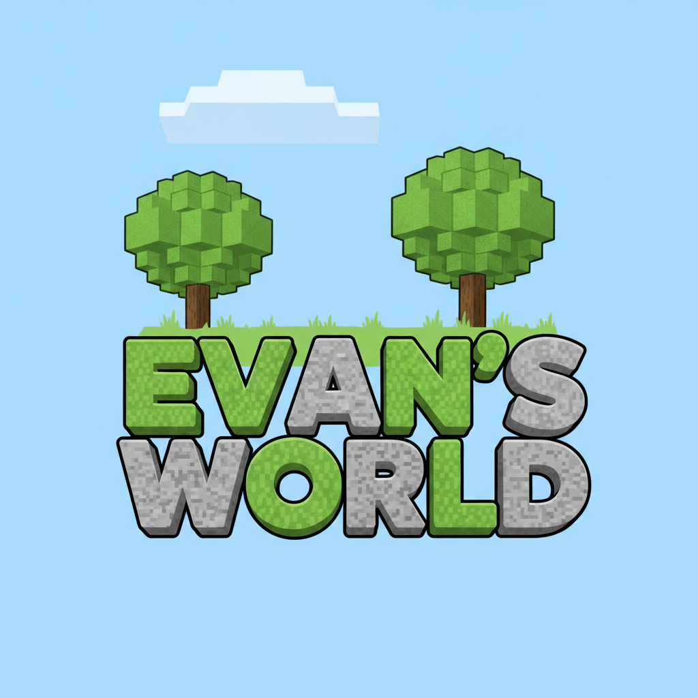
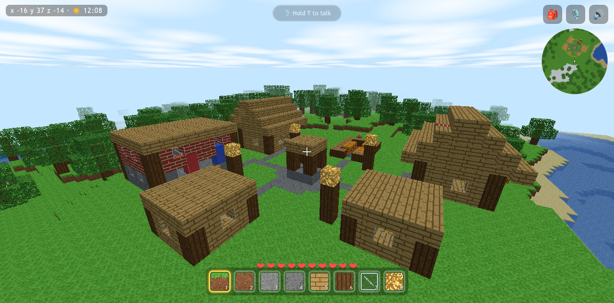
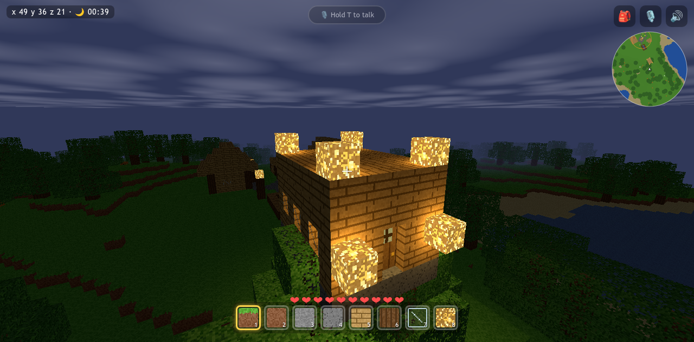
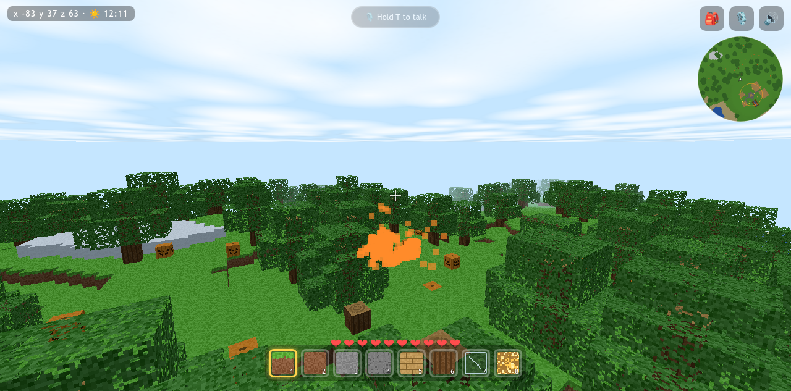
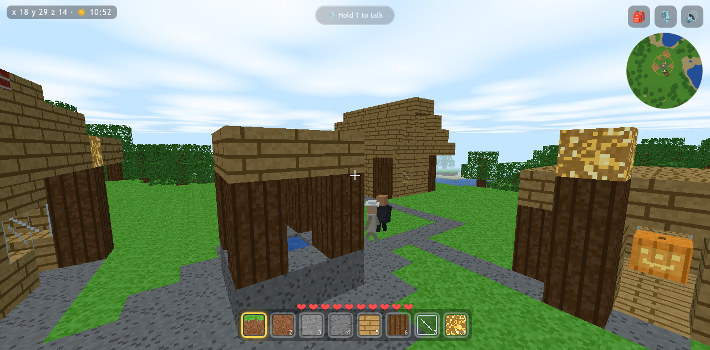

# Evan's Voxel World



A blocky voxel sandbox game, built from scratch — a fun project between a dad
and his son Evan. A FastAPI backend generates and saves the worlds; a custom
voxel engine in the browser (on top of Three.js for the WebGL plumbing) does
the rendering, physics, and block editing. No game engine, no build step, no
Node — just Python, JavaScript, and a browser.

| | |
|:---:|:---:|
|  |  |
| *The village at noon* | *A glowstone cottage after dark — shut the door, the wolves are out* |
|  |  |
| *TNT doing what TNT does* | *Villagers going about their day* |

## Why this exists

This started as a fun activity to build a game *with* my son rather than just
hand him one. Evan is the lead designer and chief play-tester: the features in
here — doors that keep wolves out, elevators, proximity mines with a
"monster trap" mode, TNT chain reactions — exist because he dreamed them up
and we made them real together. The design center is **creative building**:
blocks never run out, there's no crafting grind, and the creatures are
seasoning rather than the point.

It's shared here in case it's useful to anyone else who wants a hackable,
self-hosted sandbox for their own kids — everything runs on your machine, on
your LAN, with your family's accounts and saves staying local.

## Features

- 🌍 **Procedural worlds** — Perlin-noise hills, seas, beaches, trees, and a
  village, regenerated exactly from a tiny seed file
- 🧱 **Creative building** — every block always available, no crafting; TNT,
  glowstone, flowing water, working doors, elevators, and proximity mines
- 👨‍👩‍👦 **LAN multiplayer** — shared worlds, name tags, spatial sound, and
  push-to-talk proximity **voice chat** (WebRTC)
- 🐺 **Living creatures** — server-simulated animals, night-time hostiles, and
  chatty villagers; one 🕊️ Peaceful toggle for calmer sessions
- ⏱ **Rewind** — automatic world snapshots with an owner-only timeline to
  undo a whole session
- 🔐 **Family accounts** — local sign-in with salted+hashed passwords; worlds
  have owners and public/private visibility
- 🎵 **Synthesized audio** — generative music and effects in WebAudio, no
  asset downloads needed (real files can override them)
- 🥔 **Runs on old machines** — tuned to stay playable even on software
  (CPU-only) WebGL

## Quick start

You need **Python 3.9+** on Linux or macOS. Then:

```bash
git clone <this-repo>
cd EvansGame
./run.sh
```

Open **https://localhost:8765**, accept the one-time certificate warning
(it's your own self-signed cert), create an account, create a world, and
click to play. First launch sets up a local virtualenv and installs the two
Python dependencies (FastAPI + uvicorn); after that it starts instantly.

To play together, everyone else on the Wi-Fi opens `https://<host-ip>:8765` —
details in the [Hosting Guide](docs/HOSTING.md).

## Controls

| Input | Action |
|-------|--------|
| `W A S D` + Mouse | move + look |
| `Space` / `Shift` | jump / run |
| Left / Right click | break / place a block |
| `1`–`8` / scroll | choose a hotbar block |
| `E` | inventory (every block) |
| `V` | first / third-person view |
| `M` | sound on/off |
| hold `T` | talk (after joining voice with 🎙️) |
| `Esc` | pause |

Touch controls appear automatically on tablets. The full list — plus what
Firestone does to TNT, pumpkins, mines and elevators — is in the
[Player's Guide](docs/GAMEPLAY.md).

## Documentation

| Doc | What's in it |
|-----|--------------|
| [Player's Guide](docs/GAMEPLAY.md) | every feature explained: worlds, blocks, water, creatures, rewind, voice chat |
| [Hosting Guide](docs/HOSTING.md) | LAN multiplayer, HTTPS, accounts, backups, systemd, environment variables |
| [Architecture](docs/ARCHITECTURE.md) | how it works, code map, modding/tuning knobs |
| [Optimization Notes](docs/OPTIMIZATION-NOTES.md) | the engine performance record |
| [CHANGELOG](CHANGELOG.md) | what changed lately, one commit per entry |

## Project layout

```
server/   FastAPI backend — worldgen, storage, accounts, snapshots, creature AI
static/   the game client — custom voxel engine on Three.js, no build step
tools/    tests, backups, cert generation, asset generation, systemd unit
docs/     the guides linked above
```

## License & credits

MIT — see [LICENSE](LICENSE). Bundled third-party components (Three.js, CC0
audio) are listed in [THIRD-PARTY.md](THIRD-PARTY.md).

This game is an independent, from-scratch voxel sandbox. It is not affiliated
with, endorsed by, or derived from Minecraft, Mojang, or Microsoft, and
contains none of their code or assets.
